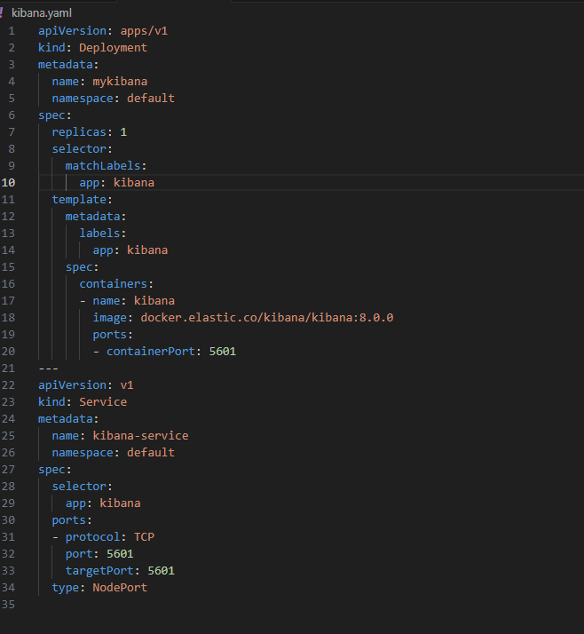
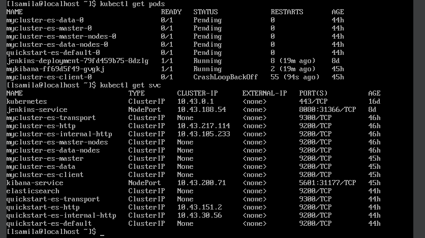
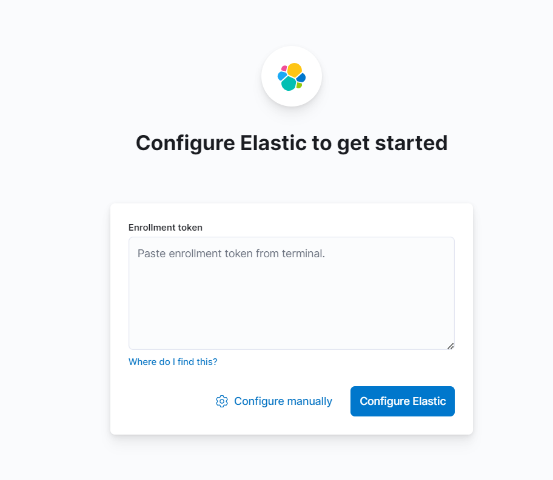

# compass-kibana-deploy


### Criar um deploy do Kibana
## Elasticsearch

**Passo 1: Instalar o Elasticsearch**
```
wget https://artifacts.elastic.co/downloads/elasticsearch/elasticsearch-8.11.1-x86_64.rpm
wget https://artifacts.elastic.co/downloads/elasticsearch/elasticsearch-8.11.1-x86_64.rpm.sha512
shasum -a 512 -c elasticsearch-8.11.1-x86_64.rpm.sha512 
sudo rpm --install elasticsearch-8.11.1-x86_64.rpm
```
**Passo 2: Generate um enrollment token node**

```
/usr/share/elasticsearch/bin/elasticsearch-create-enrollment-token -s node
```

**Passo 3: Configure o Elasticsearch para iniciar automaticamente**

```
sudo /bin/systemctl daemon-reload
sudo /bin/systemctl enable elasticsearch.service
```

- Inicie o Elasticsearch
```
sudo systemctl start elasticsearch.service
```

## Kibana

**Passo 1: Crie um deployment para o Kibana e um Service**




**Passo 2: Aplique o arquivo**

```
kubectl apply -f kibana.yaml
```

- Verifique se foi criado, e está rodando:
```
kubectl get pods
kubectl get svc
```


## No Navegador

- Coloque o endereço Ip da sua máquina e a porta de servico do Kibana:
- No meu Caso a porta era a 31177

